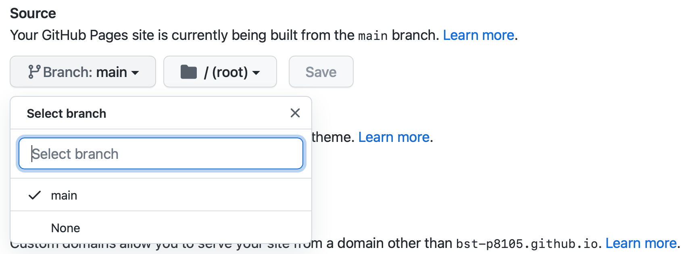

```{r setup, include=FALSE}
knitr::opts_chunk$set(echo = TRUE)
```

## This is a website


## here's a new section

## guide
This is where GitHub helps. GitHub will recognize your repository as a website and host it as such. If your repo is named <YOUR_GH_NAME>.github.io, that’s your personal site address. If your repo has another name, your site address will be <YOUR_GH_NAME>.github.io/<YOUR_PROJECT_NAME>. Often this “just works”, but sometimes you have to update the repo settings for GitHub to know this is a website, especially for websites that are not <YOUR_GH_NAME>.github.io:

Make sure you’ve pushed what you have to GitHub
Log in to GitHub, find the repo, and navigate to repo settings
Set the GitHub pages source to the main branch (see below)


{width=50%}